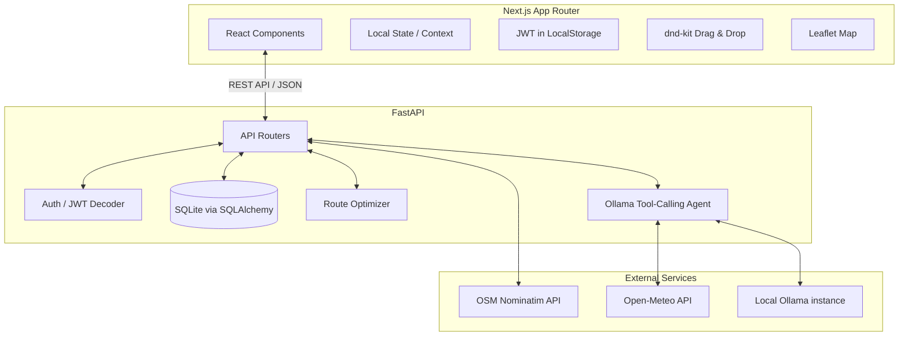

# 🗺️ TripKeeper

TripKeeper is a modern, AI-powered travel planning application. It features interactive maps, a drag-and-drop itinerary builder, real-time geocoding, public sharing links, and an autonomous AI agent capable of planning and modifying your trips via a chat interface.


## ✨ Features

- **Full-Stack Authentication:** Secure JWT-based auth with auto-logout on expiration.
- **Interactive Maps:** Real-time map rendering using Leaflet (`react-leaflet`).
- **Geocoding:** Built-in OpenStreetMap (Nominatim) integration for location lookups.
- **Drag & Drop Itinerary:** Intuitive Kanban-style itinerary builder powered by `dnd-kit`.
- **Public Sharing:** Share read-only views of your trip with collaborators via secure UUID links.
- **AI Itinerary Generator:** Generate full, multi-day itineraries based on your destination and theme using local LLMs.
- **AI Travel Agent:** A built-in chat assistant that can fetch weather, estimate budgets, and autonomously modify your itinerary using tool-calling.
- **Route Optimizer:** Built-in algorithm utilizing Nearest-Neighbor and 2-opt to minimize travel distance for any given day.

## 🏗️ Architecture



## 🚀 Tech Stack

**Frontend:**
- Next.js (App Router, TypeScript)
- Tailwind CSS
- React-Leaflet
- dnd-kit (Drag and drop)
- Axios

**Backend:**
- Python 3.11+
- FastAPI
- SQLAlchemy 2.0 (Async) + aiosqlite
- Pydantic v2
- python-jose + passlib (Auth)

**AI / Local LLM:**
- Ollama
- Default model: `qwen2.5:7b` (Configurable)

---

## 🛠️ Setup Instructions

### 1. Prerequisites
- **Node.js** (v18+)
- **Python** (v3.11+)
- **Ollama** (Running locally on port 11434)

### 2. Setup Ollama
Make sure Ollama is installed on your system. Pull the required model for the AI agent:
```bash
ollama run qwen2.5:7b
```

### 3. Backend Setup
Navigate to the `backend` directory, create a virtual environment, and install dependencies:
```bash
cd backend
python -m venv venv
source venv/bin/activate  # On Windows use `venv\Scripts\activate`
pip install -r requirements.txt
```

Create a `.env` file in the `backend` directory based on `.env.example`:
```bash
cp .env.example .env
```
*(Optionally modify `SECRET_KEY` in the `.env` file)*

Start the backend server (runs on `http://localhost:8001`):
```bash
uvicorn app.main:app --port 8001 --reload
```

### 4. Frontend Setup
Navigate to the `frontend` directory and install the npm packages:
```bash
cd frontend
npm install
```

Create a `.env.local` file in the `frontend` directory based on `.env.example`:
```bash
cp .env.example .env.local
```

Start the frontend development server (runs on `http://localhost:3000`):
```bash
npm run dev -- -p 3000
```

## 🎮 Usage
1. Go to `http://localhost:3000` and create an account.
2. Visit the **Places** tab to search and save your favorite locations.
3. Visit the **Trips** tab to create a new trip, drag and drop places into days, and view your route on the map.
4. Use the **AI Planner** to automatically generate a full itinerary for any city in the world.
5. Click the **🤖 AI Assistant** button on any trip to chat with the agent and ask it to modify your itinerary!

## 📜 License
This project is open-source and available under the MIT License.
